# Fire Enrich - AI-Powered Data Enrichment Tool

<div align="center">
  
</div>

Turn a simple list of emails into a rich dataset with company profiles, funding data, tech stacks, and more. Powered by [Firecrawl](https://www.firecrawl.dev/) and a multi-agent AI system.

## Technologies

- **Firecrawl**: Web scraping and content aggregation
- **OpenAI**: Intelligent data extraction and synthesis
- **Next.js 15**: Modern React framework with App Router

[](https://vercel.com/new/clone?repository-url=https%3A%2F%2Fgithub.com%2Fmendableai%2Ffire-enrich&env=FIRECRAWL_API_KEY,OPENAI_API_KEY&envDescription=API%20keys%20required%20for%20Fire%20Enrich&envLink=https%3A%2F%2Fgithub.com%2Fmendableai%2Ffire-enrich%23required-api-keys)

## Setup

### Required API Keys

| Service | Purpose | Get Key |
|---------|---------|---------|
| Firecrawl | Web scraping and content aggregation | [firecrawl.dev/app/api-keys](https://www.firecrawl.dev/app/api-keys) |
| OpenAI | Intelligent data extraction | [platform.openai.com/api-keys](https://platform.openai.com/api-keys) |

### Quick Start

1. Clone this repository
2. Create a `.env.local` file with your API keys:
   ```
   FIRECRAWL_API_KEY=your_firecrawl_key
   OPENAI_API_KEY=your_openai_key
   ```
3. Install dependencies: `npm install` or `yarn install`
4. Run the development server: `npm run dev` or `yarn dev`
5. Open [http://localhost:3000](http://localhost:3000)

## Example Enrichment

**Before:**
```json
{
  "email": "erez@wiz.io"
}
```

**After:**
```json
{
  "email": "erez@wiz.io",
  "companyName": "Wiz",
  "industry": "Cybersecurity",
  "employeeCount": "1001-5000",
  "yearFounded": 2020,
  "headquarters": "New York, NY",
  "fundingStage": "Series D",
  "totalRaised": "$900M",
  "website": "https://www.wiz.io",
  "sources": [
    "https://www.wiz.io/about",
    "https://techcrunch.com/2023/02/27/wiz-confirms-300m-at-a-10b-valuation-to-build-out-its-cloud-security-platform/"
  ]
}
```

## How It Works

### Architecture Overview: Following "ericciarla@firecrawl.dev" Through the System

Let's see exactly how Fire Enrich processes a real example - enriching data for the email ericciarla@firecrawl.dev.

```mermaid
graph TD
    Start["Input: ericciarla@firecrawl.dev - Industry, CEO, Funding Stage, Tech Stack"]:::primary
    
    Start -->|1. Extract Domain| Domain["Domain: firecrawl.dev - Corporate email detected"]:::primary
    
    Domain -->|2. Start Orchestration| Orchestrator["Agent Orchestrator - Executes agents in optimized sequence - Each phase builds on previous data"]:::synthesis

    %% Phase 1: Discovery
    Orchestrator -->|Phase 1| Discovery["Discovery Agent - Finds basic company info first"]:::agent
    
    Discovery -->|Parallel searches| DiscSearch["Parallel Searches: Firecrawl company, firecrawl.dev, What is Firecrawl"]:::search
    
    DiscSearch -->|Firecrawl API| DiscFC["3 concurrent API calls - Returns company website and basic information"]:::firecrawl
    
    DiscFC -->|Extracts| DiscData["Company: Firecrawl - Website: firecrawl.dev - Type: B2B SaaS"]:::source

    %% Phase 2: Company Profile
    DiscData -->|Phase 2| Profile["Company Profile Agent - Uses company name from Phase 1 to find industry details"]:::agent
    
    Profile -->|Parallel searches| ProfSearch["Parallel Searches: Firecrawl industry classification, Firecrawl web scraping API, Developer tools Firecrawl"]:::search
    
    ProfSearch -->|Firecrawl API| ProfFC["3 concurrent API calls - Searches industry-specific sources"]:::firecrawl
    
    ProfFC -->|Extracts| ProfData["Industry: Developer Tools - Sub-category: Web Scraping APIs - Market: B2B SaaS"]:::source

    %% Phase 3: Financial
    ProfData -->|Phase 3| Funding["Financial Intel Agent - Searches for funding using company and industry context"]:::agent
    
    Funding -->|Parallel searches| FundSearch["Parallel Searches: Firecrawl funding rounds, Mendable AI acquisition Firecrawl, Firecrawl investors crunchbase"]:::search
    
    FundSearch -->|Firecrawl API| FundFC["3 concurrent API calls - Checks TechCrunch, Crunchbase, venture news sites"]:::firecrawl
    
    FundFC -->|Extracts| FundData["Funding: Seed Stage - Part of Mendable AI - YC-backed company"]:::source

    %% Phase 4: Tech Stack
    FundData -->|Phase 4| Tech["Tech Stack Agent - Analyzes GitHub and tech docs - HTML source analysis"]:::agent
    
    Tech -->|Parallel searches| TechSearch["Parallel Searches: github.com/mendableai/firecrawl, Firecrawl API documentation, Direct HTML analysis"]:::search
    
    TechSearch -->|Firecrawl API| TechFC["3 concurrent API calls - HTML meta tag analysis - GitHub repo scan"]:::firecrawl
    
    TechFC -->|Extracts| TechData["Tech Stack: Node.js, Python, Redis, Playwright, Kubernetes"]:::source

    %% Phase 5: General
    TechData -->|Phase 5| General["General Purpose Agent - Handles custom field CEO - Uses all previous context"]:::agent
    
    General -->|Targeted search| GenSearch["Focused Search: Firecrawl CEO founder Eric, Eric Ciarla Firecrawl, LinkedIn company search"]:::search
    
    GenSearch -->|Firecrawl API| GenFC["3 concurrent API calls - Cross-references multiple sources"]:::firecrawl
    
    GenFC -->|Extracts| GenData["CEO: Eric Ciarla - Co-founder and CEO of Firecrawl - Previously at Mendable AI"]:::source

    %% Final Synthesis
    DiscData --> Synthesis
    ProfData --> Synthesis
    FundData --> Synthesis
    TechData --> Synthesis
    GenData --> Synthesis
    
    Synthesis["GPT-4o Final Synthesis - Combines all agent findings - Resolves conflicts, validates data"]:::synthesis
    
    Synthesis -->|Outputs| Results
    
    subgraph Results[Enriched Data]
        R1["Industry: Developer Tools / Web Scraping - Source: firecrawl.dev/about"]:::good
        R2["CEO: Eric Ciarla Co-founder and CEO - Source: linkedin.com/company/firecrawl"]:::good
        R3["Funding: Seed Part of Mendable AI - Source: crunchbase.com"]:::good
        R4["Tech Stack: Node.js, Python, Redis, K8s - Source: github.com/mendableai/firecrawl"]:::good
    end
    
    Results -->|Final Output| Output["Updated CSV Row: ericciarla@firecrawl.dev - Complete profile with 4 new data points and sources"]:::answer
    
    classDef primary fill:#ff8c42,stroke:#ff6b1a,stroke-width:2px,color:#fff
    classDef agent fill:#9c27b0,stroke:#7b1fa2,stroke-width:2px,color:#fff
    classDef search fill:#e8e8e8,stroke:#999,stroke-width:2px,color:#333
    classDef firecrawl fill:#ff6b1a,stroke:#ff4500,stroke-width:3px,color:#fff
    classDef source fill:#ffa726,stroke:#ff8c42,stroke-width:2px,color:#000
    classDef synthesis fill:#ff8c42,stroke:#ff6b1a,stroke-width:3px,color:#fff
    classDef good fill:#f5f5f5,stroke:#666,stroke-width:1px,color:#000
    classDef answer fill:#333,stroke:#000,stroke-width:3px,color:#fff
```



### How Each Agent Works

Behind the scenes, each agent is a specialized module with its own expertise, search strategies, and type-safe output schema:

1. **Discovery Agent** (Phase 1)
   - Establishes company basics: official name, website, type of business
   - Essential first step that provides the foundation for all other agents
   - **Returns**: Company name, website URL, business type
   - **Schema**: `DiscoveryResult` with fields like `companyName`, `website`, `domain`

2. **Company Profile Agent** (Phase 2)
   - Uses verified company name to search for industry and market positioning
   - Builds on Discovery data to ensure accurate industry classification
   - **Returns**: Industry, sub-category, business model, market segment
   - **Schema**: `ProfileResult` with `industry`, `headquarters`, `yearFounded`, `companyType`

3. **Financial Intel Agent** (Phase 3)
   - Leverages company name + industry context for targeted funding searches
   - Knowing the industry helps identify relevant investor databases
   - **Returns**: Funding stage, total raised, key investors, valuation
   - **Schema**: `FundingResult` with `fundingStage`, `totalRaised`, `lastRoundAmount`, `investors`

4. **Tech Stack Agent** (Phase 4)
   - Analyzes technology with context of company type and funding stage
   - HTML analysis, GitHub repos, and technical documentation
   - **Returns**: Programming languages, frameworks, infrastructure, tools
   - **Uses**: Direct `EnrichmentResult` schema for flexible tech stack extraction

5. **General Purpose Agent** (Phase 5)
   - Handles custom fields (like CEO, competitors, etc.) with full context
   - Benefits from all previous data to make targeted searches
   - **Returns**: Any custom field requested by the user
   - **Uses**: Dynamic `EnrichmentResult` schema based on user-defined fields

### Why Sequential Execution?

The agents execute in a carefully designed sequence where each phase builds upon the previous one:

- **Context Building**: Each agent adds context that makes subsequent searches more accurate. For example, knowing a company's industry helps the funding agent search in the right venture databases.
- **Data Validation**: Later agents can validate and refine data from earlier phases.
- **Efficiency**: Prevents redundant searches by sharing discovered information across phases.
- **Parallel Searches Within Phases**: While agents run sequentially, each agent performs multiple searches in parallel, maximizing speed.

This architecture balances accuracy with performance - we could run all agents in parallel, but the sequential approach with shared context produces significantly better results.

### Extensibility Through Type-Safe Schemas

Each agent uses [Zod](https://zod.dev/) schemas to ensure type safety and make the system easily extensible:

```typescript
// Example: Adding a new field to the FundingAgent
const FundingResult = z.object({
  fundingStage: z.string().optional(),
  totalRaised: z.string().optional(),
  lastRoundAmount: z.string().optional(),
  investors: z.array(z.string()).optional(),
  // Add your new field here:
  debtFinancing: z.string().optional(),
});
```

**To extend Fire Enrich with new data extraction capabilities:**

1. **Add to existing agent**: Modify the Zod schema in `/lib/agent-architecture/agents/[agent-name].ts`
2. **Create a new agent**: Define a new schema and implement the `AgentBase` interface
3. **Update the orchestrator**: Add routing logic to direct fields to your new agent
4. **Use custom fields**: The General Agent handles any field not covered by specialized agents

The field routing system automatically categorizes user requests:
- Fields with "industry" or "headquarter" → Company Profile Agent
- Fields with "fund" or "invest" → Financial Intel Agent  
- Fields with "employee" or "revenue" → Metrics Agent
- Fields with "tech" and "stack" → Tech Stack Agent
- Everything else → General Purpose Agent

This design allows Fire Enrich to grow with your needs while maintaining type safety and predictable behavior.

### Process Flow

1.  **Upload & Parse**: Upload a CSV with emails. The system extracts the company domain from each email.
2.  **Field Selection**: Choose the data points you need, from company descriptions to funding stages.
3.  **Sequential Agent Execution**: Agents activate in phases, each building on previous discoveries for maximum accuracy.
4.  **Parallel Searches Per Phase**: Within each phase, multiple searches run concurrently using the Firecrawl API.
5.  **AI Synthesis**: GPT-4o analyzes all findings, resolves conflicts, and extracts structured data.
6.  **Real-time Results**: Your table populates in real-time, complete with enriched data and source citations.

### The Multi-Agent System

Fire Enrich employs a sophisticated orchestration system that coordinates specialized extraction modules. These aren't autonomous AI agents, but rather purpose-built components that work together intelligently:

-   **Discovery Phase**: Establishes the foundation by identifying the company and its digital presence
-   **Profile Extraction**: Specialized logic for industry classification and business model analysis
-   **Financial Intelligence**: Targeted searches across venture databases and news sources
-   **Technical Analysis**: Deep inspection including HTML parsing and repository analysis
-   **Custom Field Handler**: Flexible extraction for any user-defined data points

Each module uses GPT-4o for intelligent data extraction, but follows deterministic search patterns optimized through extensive testing. This hybrid approach combines the reliability of structured programming with the flexibility of AI-powered comprehension.

### Key Features

-   **Phased Extraction System**: Sequential modules that build context for increasingly accurate results.
-   **Drag & Drop CSV**: Simple, intuitive interface to get started in seconds.
-   **Customizable Fields**: Choose from a list of common data points or generate your own with natural language.
-   **Real-time Streaming**: Watch your data get enriched row-by-row via Server-Sent Events.
-   **Full Source Citations**: Every piece of data is linked back to the URL it was found on, ensuring complete transparency.
-   **Skip Common Providers**: Automatically skips personal emails (Gmail, Yahoo, etc.) to save on API calls and focus on company data.

### Configuration & Unlimited Mode

When you clone and run this repository locally, Fire Enrich automatically enables **Unlimited Mode**, removing the restrictions of the public demo. You can configure these limits in [`app/fire-enrich/config.ts`](app/fire-enrich/config.ts):

```typescript
const isUnlimitedMode = process.env.FIRE_ENRICH_UNLIMITED === 'true' || 
                       process.env.NODE_ENV === 'development';

export const FIRE_ENRICH_CONFIG = {
  CSV_LIMITS: {
    MAX_ROWS: isUnlimitedMode ? Infinity : 15,
    MAX_COLUMNS: isUnlimitedMode ? Infinity : 5,
  },
  REQUEST_LIMITS: {
    MAX_FIELDS_PER_ENRICHMENT: isUnlimitedMode ? 50 : 10,
  },
} as const;
```

## Our Open Source Philosophy

Let's be blunt: professional data enrichment services are expensive for a reason. Our goal with Fire Enrich isn't to replicate every feature of mature platforms overnight. Instead, we want to build a powerful, open-source foundation that anyone can use, understand, and contribute to.

This is just the start. By open-sourcing it, we're inviting you to join us on this journey.

-   **Add a new agent?** Fork the repo and show us what you've got.
-   **Improve a data extraction prompt?** Open a pull request.
-   **Have a new feature idea?** Start a discussion in the issues.

We believe that by building in public, we can create a tool that is more accessible, affordable, and adaptable, thanks to the collective intelligence of the open-source community.

## License

MIT License - see [LICENSE](LICENSE) file for details.

## Contributing

We welcome contributions! Please feel free to submit a Pull Request.

## Support

For questions and issues, please open an issue in this repository.
